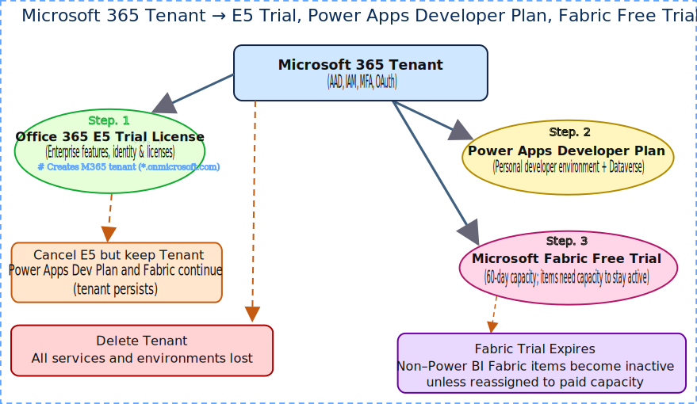

# 🧭 User's Guide: Clinical Intelligence Agent Backend

**Welcome!** This repository contains the end-to-end backend for a Secure Clinical AI.
Follow this "Lab Manual" to step through the architecture from **Data Ingestion** to **AI Safety**.

> **Prerequisite:** 
---

## Quick note for users with a personal email (beginner friendly)
Many of the services used in this project (Microsoft Fabric, OneLake, Power Apps, Office 365) are organized around an Azure / Microsoft 365 tenant — effectively an account "container" that holds subscriptions and licenses. If you only have a personal Microsoft account (Hotmail/Outlook) you may encounter a few frictions:
- Some Fabric and enterprise-grade features require an Azure AD tenant or an organizational subscription (not a consumer account).
- Trials and developer plans often require linking to a tenant and may need verification (credit card for trial sign-up).
- Cancelling a trial subscription or deleting the tenant can disable or remove resources associated with that tenant.
If you do not have an organizational tenant yet, the steps below explain an approachable path using free trials and developer sign-ups so you can experiment without an existing corporate account.

---

## Getting Started (personal account)
Follow these steps in order. They create a tenant and add the developer services needed to run the notebooks against Microsoft Fabric / OneLake.

A. Sign up for an Office 365 E5 Trial (creates a tenant)
1. Go to the Office 365 E5 trial sign-up page: https://www.microsoft.com/microsoft-365/enterprise/office-365-e5
2. Create a new Microsoft account or sign in with a personal email. During sign-up you will create a new Microsoft 365 Tenant (organization).
3. Verify identity (may require credit card). After sign-up you will have a tenant and admin user you control.
4. Note the tenant admin email and password — you will use them in later steps.

B. Sign up for the Power Apps Developer Plan (developer tooling & maker features)
1. Sign in at https://www.microsoft.com/en-us/power-platform/products/power-apps with the tenant admin from Step A.
2. Choose the "Developer Plan" (free for individual developers) and enroll using the tenant admin account. This gives you access to maker tools and a personal dev environment in the same tenant.

C. Sign up for a Microsoft Fabric free trial
1. Sign in at the Microsoft Fabric trial page: https://app.fabric.microsoft.com/
2. Start a free trial and select the tenant you created during the Office 365 E5 sign-up.
3. Create a Fabric workspace (you will get an `AZURE_WORKSPACE_ID` / workspace GUID). Note this workspace ID for your .env.

D. Quick checklist (what to record in .env)
- `AZURE_TENANT_ID` — find under Azure Active Directory → Properties
- `AZURE_SUBSCRIPTION_ID` — from your Azure subscription (if created)
- `AZURE_WORKSPACE_ID` — Fabric workspace GUID (from Fabric URL)
- `AZURE_WORKSPACE_NAME` — Fabric workspace name

---

## Visual diagram — how these accounts/services relate

```
Microsoft 365 Tenant (you create)
+-------------------------------+
|  - Tenant (Azure AD)          |
|  - Admin user (you)           |
+-------------------------------+
           |
           +--> Office 365 E5 Trial (gives licenses, optionally creates subscription)
           |
           +--> Power Apps Developer Plan (developer tools attached to tenant)
           |
           +--> Microsoft Fabric free trial (creates Fabric workspace in tenant)
```
If you CANCEL the Office 365 E5 Trial before it expires:
- Licenses provided by the E5 trial are removed or disabled for users.
- The tenant (Azure AD) usually remains unless you delete it. Developer plans and Fabric workspace remain linked to the tenant but some services may stop working if they depended on trial licenses.
- If you DELETE the tenant or its subscription, services tied to that tenant (Power Apps dev environment, Fabric workspace, OneLake resources) can be disabled or eventually deleted — keep a backup of any important data before deleting a tenant.

---

## How you can run this project — three common paths (beginner friendly)
There are three practical ways to run and explore this repo. All are supported; pick the one that fits your comfort level and environment.

1) GitHub Codespaces (recommended for beginners)
   - Pros: Minimal local setup, prebuilt environment, quick start.
   - Cons: Requires a GitHub account; Codespaces usage may incur billing for compute time.
   - What you need: GitHub account and permission to create a Codespace. Open the repo and click "Open in Codespaces."
   - Quick checklist:
     - [ ] Create a Codespace for this repo
     - [ ] Open a terminal and run `pip install -r requirements.txt` (if needed)
     - [ ] Rename `.env.template` to `.env` and populate values

2) Clone and run locally (fully manual)
   - Pros: Works on any machine you control (Linux/macOS/Windows + WSL).
   - Cons: You must install Python, pip, Azure CLI, Jupyter components, and any other tooling manually.
   - Quick checklist:
     - [ ] Install Python 3.10+, pip3, git, and Azure CLI
     - [ ] pip install -r requirements.txt
     - [ ] Install Jupyter components (notebook, nbconvert, nbclient) if running notebooks locally
     - [ ] Rename `.env.template` to `.env` and populate values

3) Use the VS Code devcontainer (recommended if you use Docker)
   - Pros: Reproducible, consistent environment; dependencies preinstalled in container.
   - Cons: Requires Docker (or Docker Desktop / WSL2) and the VS Code Remote - Containers extension.
   - Quick checklist:
     - [ ] Install Docker and the VS Code Remote - Containers extension
     - [ ] Reopen the repo in container ("Reopen in Container")
     - [ ] Rename `.env.template` to `.env` and populate values


Notes and caveats
- Codespaces offers the fastest onboarding but may charge for compute. Use trial credits or your organization plan when available.
- The devcontainer replicates the environment used by maintainers (Debian Bullseye, preinstalled CLI tooling) and is a good middle ground if you can run Docker.
- Cloning locally gives full control but requires installing and configuring Azure/Fabric credentials yourself.

---

## 🛠️ Step 0: Environment Setup
Before we touch data, let's make sure our tools are sharp.

1.  **In VS Code open the Terminal:**
    * Press `Ctrl + ~` (Windows) or `Cmd + ~` (Mac).
2.  **Install Dependencies:**
    Run this command to install the required Python libraries:
    ```bash
    pip install -r requirements.txt
    ```
3.  **Configure Secrets (Crucial):**
    * Rename `.env.template` to `.env`.
    * Paste your Azure credentials (Workspace ID, Connection Strings) into `.env` if you already know the values.
    * *Note: Without this, some cells in the notebooks may fail or run in "Simulation Mode" or fail to connect to the cloud.*

---

## 🥉 Step 1: Data Ingestion (The Bronze Layer)
**Goal:** We need to fetch raw oncology data from the public internet (cBioPortal) and land it securely in our Private Cloud (OneLake).

1.  **Open the Notebook:**
    👉 [**Click to Open `01_data_ingestion/1_ingestion_pipeline.ipynb`**](./01_data_ingestion/1_ingestion_pipeline.ipynb)

2.  **What to do:**
    * Read the "Concept Guides" in the Markdown cells.
    * Run the code cells to see how we verify the Azure connection (`az login`) and stream the download.
    * *Output:* You will see a progress bar (`tqdm`) as files are uploaded to the `Raw/` folder in OneLake.

---

## 🥈 Step 2: Transformation (The Silver Layer)
**Goal:** Raw data is messy. We use **PySpark** to clean it and structure it into Delta Tables.

* *Note:* This step typically runs inside the **Microsoft Fabric** SaaS environment, not locally in VS Code.
* **Inspect the Code:**
    👉 [**View `fabric_code/bronze_to_silver_etl.py`**](./fabric_code/bronze_to_silver_etl.py)
* **Key Takeaway:** Notice how we use `mssparkutils` to mount the lakehouse and clean column names before saving to Delta format.

---

## 📊 Step 3: Analysis & Validation (The Gold Standard)
**Goal:** Now that we have clean data, we must prove it is "Organic" (not artificially capped) before training AI on it.

1.  **Open the Notebook:**
    👉 [**Click to Open `02_backend_logic/2_data_analysis.ipynb`**](./02_backend_logic/2_data_analysis.ipynb)

2.  **What to do:**
    * Click **Run All**.
    * This notebook connects via **ODBC/SQL** to the Silver Delta Tables we created in Step 2.
    * **The "Aha!" Moment:** Scroll to **Step 4**. Look at the histogram. You should see a *smooth tail* (patients surviving 80+ months), proving there is no artificial "60-month wall."

---

## 🛡️ Step 4: Safety Guardrails (The Shield)
**Goal:** Finally, we test the Middleware that sits between the User and the AI to prevent data leaks.

1.  **Run the Test Suite:**
    Paste this command into your terminal to run the automated compliance checks:
    ```bash
    python -m safety_middleware.test_guardrails
    ```

2.  **Verify the Output:**
    You should see the system blocking unsafe prompts:
    * `Scanning: '...dosage for Aspirin?'` → **✅ PASSED**
    * `Scanning: '...patient TCGA-OR-A5J1...'` → **⚠️ BLOCKING: PII Detected**
    * `Scanning: '...hack the mainframe?'` → **⛔ BLOCKING: Content Violation**

---
*Project by **IAYF Consulting** | [View on GitHub](https://github.com/CarnegieJ/onc-clinical-intel-agent)*
